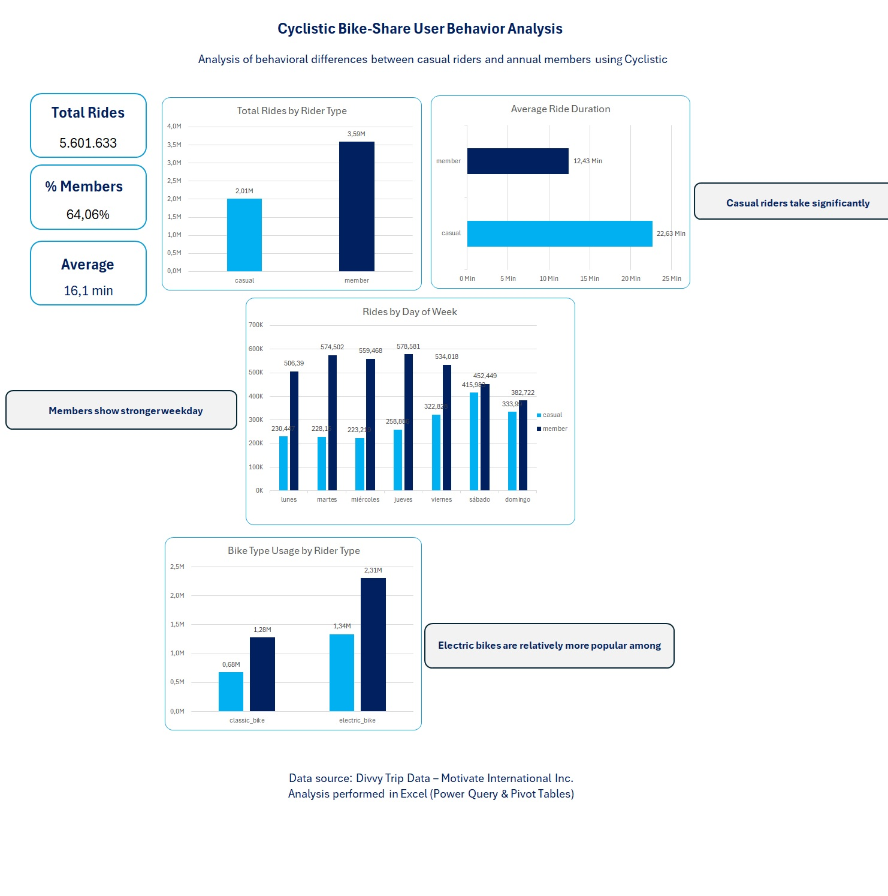

# cyclistic-bike-share-analysis
Google Data Analytics Capstone Project – Cyclistic Case Study

This project is the final case study of the Google Data Analytics Professional Certificate.  
The objective is to analyze how different types of users interact with Cyclistic’s bike-share service and provide data-driven recommendations to support business decision-making.

---

## 📌 Business Task

Cyclistic, a bike-share company based in Chicago, wants to increase the number of annual memberships.  
The marketing team needs insights into how **casual riders** and **annual members** use the service differently in order to design strategies that encourage casual riders to become members.

---

## 🎯 Project Objectives

- Identify behavioral differences between casual riders and members
- Analyze ride patterns across time and bike types
- Transform raw trip data into actionable business insights
- Provide strategic recommendations supported by data

---

## 🛠️ Tools & Skills Used

- **Excel**
  - Power Query (data cleaning & transformation)
  - Data Model
  - Pivot Tables
  - Dashboard creation
- **SQL (Google BigQuery)** for data validation and exploration
- Data Visualization
- Business Analysis & Storytelling

---

## 📂 Data Source

The dataset comes from the **Divvy Bike Share** public dataset:

https://divvy-tripdata.s3.amazonaws.com/index.html

- Location: Chicago, USA
- Period analyzed: **March 2025 – February 2026**
- Format: Monthly CSV files
- Dataset size: ~5.6 million rides

The data is anonymized and does not contain personally identifiable information.

---

## 🧹 Data Preparation

Data preparation was performed using Power Query:

- Combined 12 monthly datasets into a single table
- Standardized data types
- Removed invalid or null records
- Created calculated fields:
  - `ride_length` (trip duration)
  - `weekday`
  - `weekday_number` (for correct sorting)

SQL queries in BigQuery were used to validate totals and averages before visualization.

---

## Dashboard

The dashboard summarizes key usage patterns between rider types.

---

## Analysis Highlights

Key analyses included:

- Total rides by user type
- Average ride duration comparison
- Weekly usage patterns
- Bike type preferences

The analysis reveals clear behavioral differences between casual riders and members.

---

## Key Findings

- Annual members generate significantly more rides overall.
- Casual riders tend to take longer trips on average.
- Members ride more frequently during weekdays, suggesting commuting behavior.
- Casual riders show peak usage during weekends, indicating leisure usage.
- Electric bikes appear particularly popular among casual riders.

---

## Recommendations

Based on the analysis:

- Target weekend casual riders with membership promotions.
- Promote membership benefits for frequent commuters.
- Highlight electric bike comfort and accessibility in marketing campaigns.
- Offer trial memberships or short-term incentives to encourage conversion.

---

## Limitations

- No demographic data available for deeper segmentation.
- Weather and seasonal factors were not included.
- Analysis focuses on aggregated behavior rather than individual users.

---

## Full Report

The complete analytical report can be found here:

👉 **Project_Report.pdf**

---

## Author

**Alberto Moffa**  
Aspiring Data Analyst  

Google Data Analytics Professional Certificate

---

## About This Project

This project demonstrates an end-to-end data analysis workflow:

**Ask → Prepare → Process → Analyze → Share → Act**

from raw data to business recommendations.
